# MEGARESTAURANT BOOKING SYSTEM

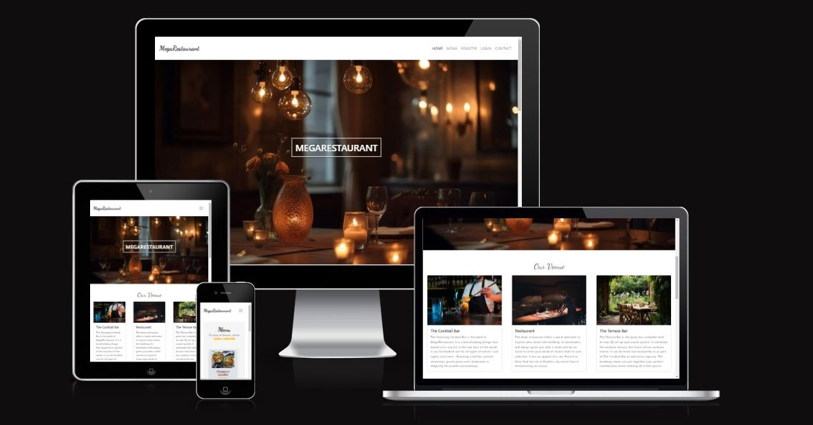

A web application that enables users to know more about the restaurant, manage bookings and view the menu, as well as a tool for restaurant owners and staff to organise their bookings.

Visit the live site: [MegaRestaurant booking system](https://megarestaurant-20c7141b277b.herokuapp.com/)

# Table of contents

- [User Experience (UX)](#User-Experience-UX)
  - [User Stories](#User-Stories)

- [Agile Metodology](#Agile-metodology)

- [Design](#Design)

  - [Flowchart](#Flowchart)
  - [Database Schema](#Database-Schema)
  - [Colour Palette](#Colour-Palette)
  - [Typography](#Typography)
  - [Imagery](#Imagery)
  - [Wireframes](#Wireframes)
  - [Features](#Features)
  

- [Technologies Used](#Technologies-Used)

  - [Languages Used](#languages-used)
  - [Frameworks, Libraries & Programs Used](#frameworks-libraries--programs-used)

- [Deployment & Local Development](#Deployment--Local-Development)

  - [Deployment](#Deployment)
  - [Local Development](#Local-Development)
    - [How to Fork](#How-to-Fork)
    - [How to Clone](#How-to-Clone)

- [Testing](#Testing)

- [Credits](#Credits)
  - [Code Used](#code-used)
  - [Content](#content)
  - [Media](#media)
  - [Acknowledgments](#Acknowledgments)

---

## User Experience (UX)

#### Key information for the site

This section provides insight into the UX process, with a focus on the people who this restaurant booking system has been created for, the main aims of the project and how it can help users to meet their needs.

Project goals:

- To encourage people to know and book in the restaurant.

- To provide an easy and user-friendly web app where users can book and know more.

- To provide a system where restaurant owners and staff can manage bookings and interact with customers.

### User Stories

|   EPIC                                |ID|                                User Story                                                   |
| :-------------------------------------|--|:------------------------------------------------------------------------------------------- |
|**CONTENT AND NAVIGATION**             |  ||
|                                       |1A| As a user, I want to see a menu so I can easily access all the content |             
|                                       |1B| As a user, I want to see relevant information about the restaurant|
|                                       |1C| As a user, I want the website to have a nice and intuitive design that will match the restaurant's theme|
|**USER REGISTRATION/AUTENTHICATION**   |  || 
|                                       |2A| As a user, I want to be able to register on the website|
|                                       |2B| As a user, I want to be able to authenticate using only email and password|
|                                       |2C| As a user, I want to be able to log out at any time|
|**BOOKING**                            |  ||
|                                       |3A| As a logged-in user, I want to be able to find the available tables for a specific date and time|
|                                       |3B| As a logged-in user, I want to be able to select the table that I want to reserve|
|**MENU**                               |  ||
|                                       |4A| As a user, I want to see the restaurant's menu with details about description, category and price, so that I can make an informed decision|                                  
|**USER PROFILE**                       |  ||
|                                       |5A| As a logged-in user, I want to view a list of my upcoming bookings|
|                                       |5B| As a logged-in user, I want to be able to edit my bookings|
|                                       |5C| As a logged-in user, I want to be able to delete my bookings|
|**ADMIN MANAGE BOOKINGS**              |  ||
|                                       |6A| As a logged-in admin member, I want to see the restaurant's upcoming bookings for the current day sorted by time|
|                                       |6B| As a logged-in admin member, I want to be able to filter bookings by date|
|**CONTACT**                            |  ||
|                                       |7A| As a user, I want to see the restaurant's opening and closing hours|
|                                       |7B| As a user, I want to see location information on the website|
|                                       |7C| As a user, I want to see contact information on the website|

---

## Agile Metodology

The MoSCow method was used with accompanying custom Github project labels to help me to prioritise the important tasks.

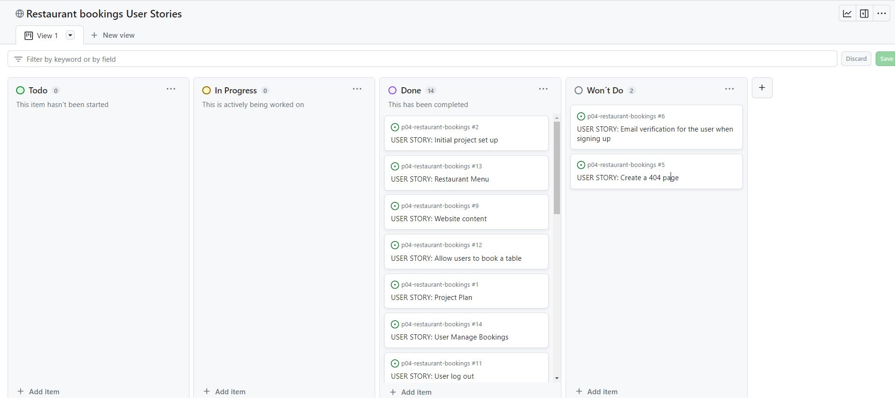

### MoSCoW Prioritization
I've decomposed my Epics into stories prior to prioritizing and implementing them. Using this approach, I was able to apply the MoSCow prioritization and labels to my user stories within the Issues tab.

- **Must Have:** guaranteed to be delivered (max 60% of stories)
- **Should Have:** adds significant value, but not vital (the rest ~20% of stories)
- **Could Have:** has small impact if left out (20% of stories)
- **Won't Have:** not a priority for this iteration

---

## Design

### Flowchart

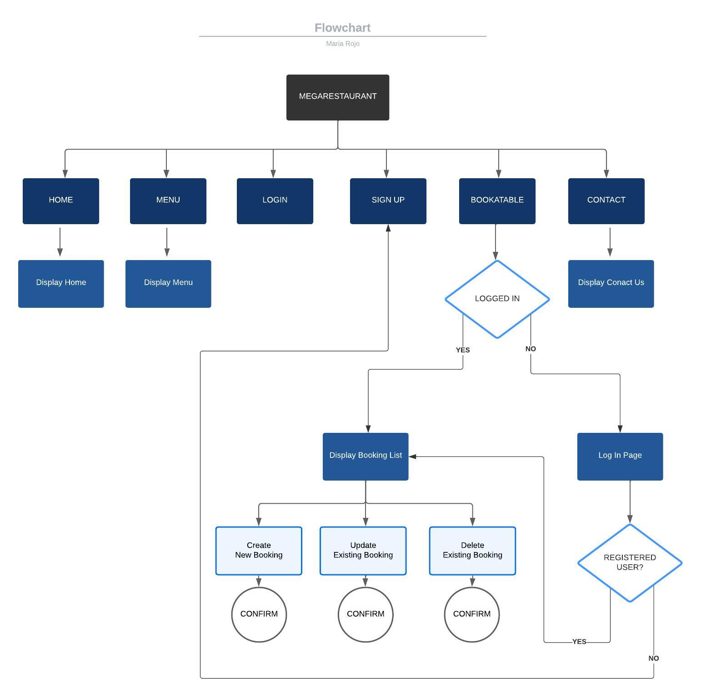

### Database Schema
The database schema shows the structure of the database, the type and their relationship. This schema was done using 
[Lucid Chart](https://www.lucidchart.com/)

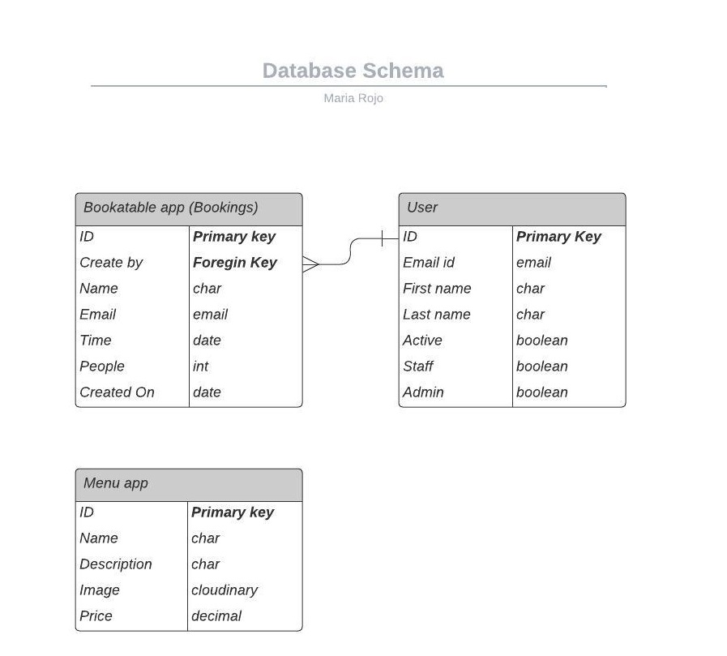

### Colour Palette

Extracted from a picture with healthy restaurant theme, which was picked for the cover image, using the colour picker, after picking the cover image this matching colour palette was selected using [Coolors](https://coolors.co/) and other pictures containing the same colour scheme for a consistent visual design.

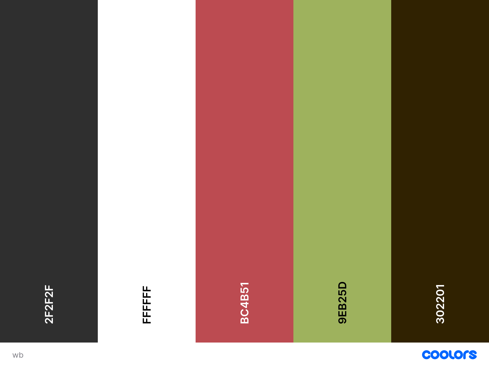

### Typography
For the logo I have used Family Dancing which is a script typeface and looks elegant which matches the rest of the visual identity.
This font was used in some headings such as the homepage in order to embellish it and then for the body copy a readable sans serif, optimal for web design such as Roboto. This last one is also used in the form headings as it is easier to read.
The fonts were taken from Google Fonts:

- [Roboto](https://fonts.google.com/specimen/Roboto)
- [Dancing Script](https://fonts.google.com/specimen/Dancing+Script)

### Imagery

The images are taken from the royalty-free sites credited [here](#Credits).

### Wireframes

Wireframes for desktop, tablet and mobile versions are as follows:

- Home 
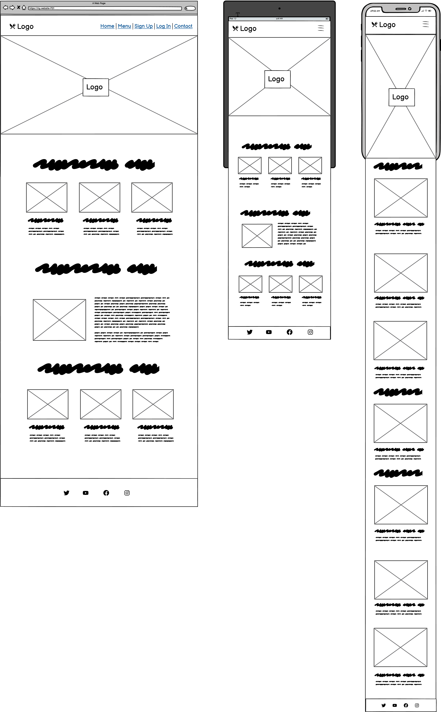

- Menu 
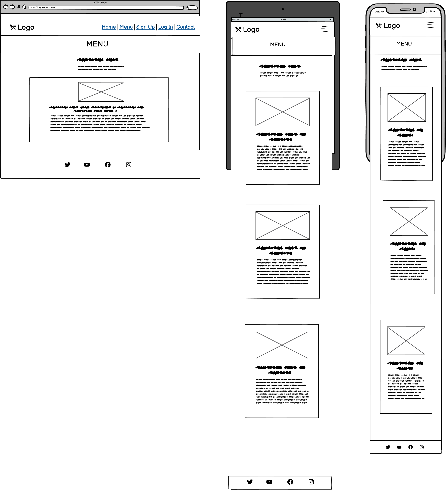

- Bookings 
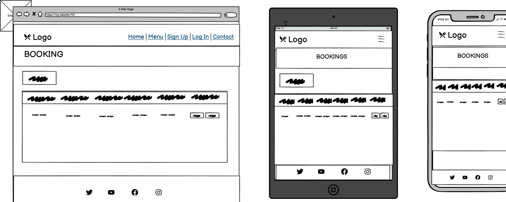

- Contact 
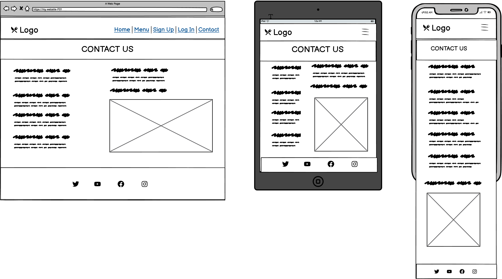

### Features

#### Existing Features

**Logo**

- The website visual identity.

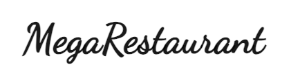

**Nav Bar**

- All pages include a navigation bar

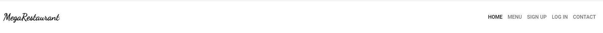

**Footer**

- All pages include a footer with social media links

**Hero Imange**

- The home page includes a hero image.

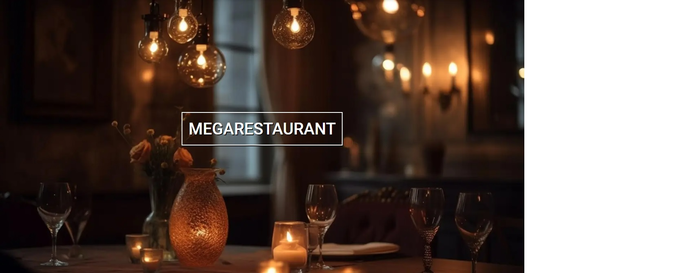

**About Us**

- The home page includes an about us section where the areas available are presented to the user.

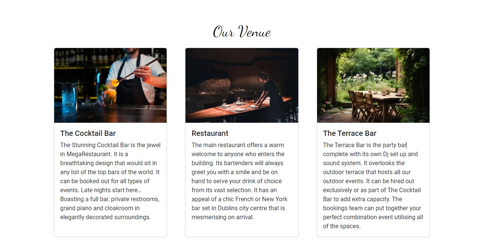

**Events**

- The home page includes a an events section where upcoming events are advertised.

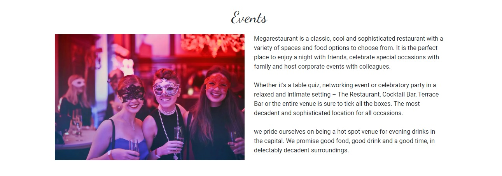
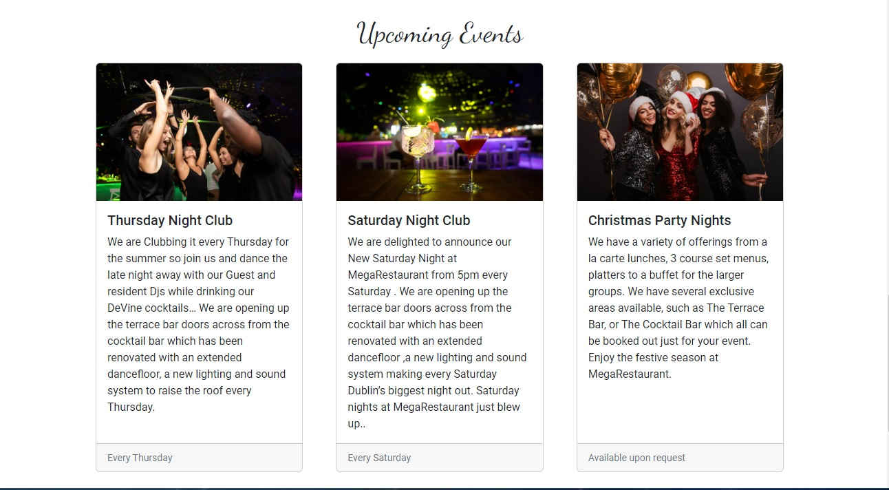

**Menu Page**

- The menu page displays the restaurant menu items.

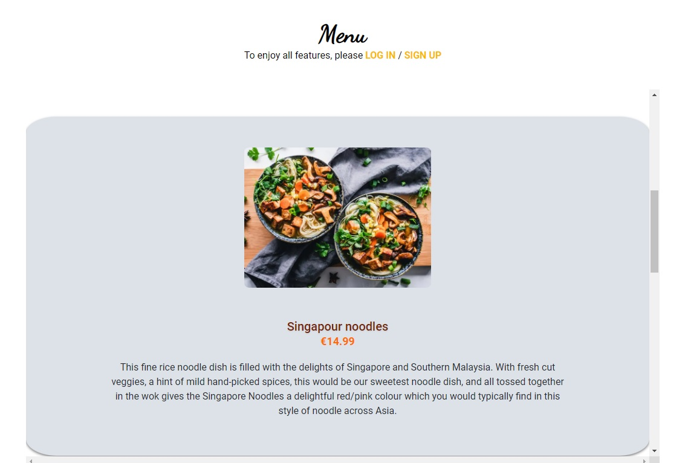

**Make a booking**

- A booking can be created from this page.

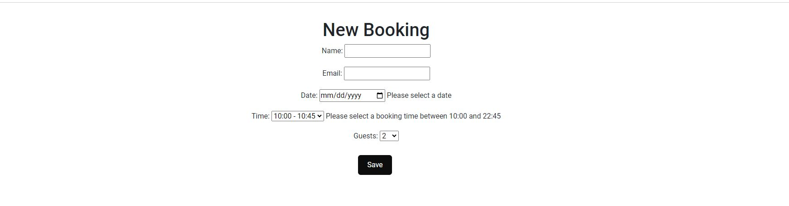

**Booking list**

- A list of the bookings is displayed on this page.

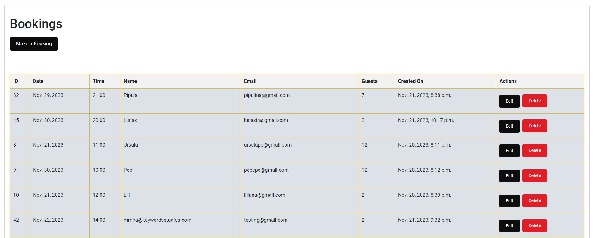

**Edit bookings**

- The user can edit their bookings.

**Delete bookings**

- The user can delete their bookings.

**Confirmation message**

- A confirmation message is displayed before deleting a booking.

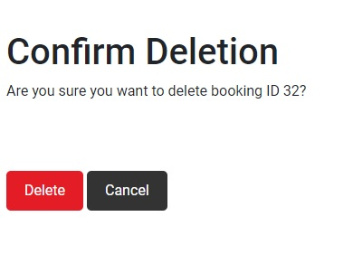

**User Feedback**

- The user receives feedback providing messages with relevant information such as their logged in status or booking success as in the example bellow:

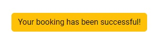

---

### Features Left to Implement

In the future, I would like to:

- Add different menus, such as cocktail menus, set menus, group menus.

- Add different prices and varieties for the same dish with extra ingredients

- Add allergens infographic to the menu & specify the dishes containing them, add a filter to sort by allergen.

- Events bookings (on top of regular bookings) in which the user can specify what event they would like to attend, or big group bookings.

- Arrows to scroll up and down through the content in the home page for easier navigation.

- Add password reset & forgot user reminder.

- Add error pages such as 404 or 505.

- Add a fav icon there was an error 404 when adding the link for the fav icon to base.html

---

## Technologies Used

### Languages Used

The language used is Python

### Frameworks, Libraries & Programs Used

[Lucid chart](https://www.lucidchart.com/pages/) - Used to create flowcharts.

[Git](https://git-scm.com/) - For version control.

[GitHub](https://github.com/) - To save and store the files for the website.

[Shields](https://shields.io/) - To add badges to the readme file.

[Amiresponsive](https://ui.dev/amiresponsive) - To generate a mockup in different screen sizes.

[Windows photo feature](https://www.microsoft.com/en-us/windows/photo-movie-editor) - To trim screen recording.

[Veed](https://www.veed.io/convert/mp4-to-gif?gad=1&gclid=CjwKCAjwgqejBhBAEiwAuWHioCzHSc5XTTdsnixrxavlvLKEi4i_YeN__Xol0nANQCBhw60caeyF3RoC31wQAvD_BwE) - To convert mp4 to gif

[Heroku](https://id.heroku.com/) - To deploy the App.

[Code Institute template](https://github.com/Code-Institute-Org/p3-template) - To run the game in the terminal using Heroku.

[Django](https://www.djangoproject.com/) - Web Framework.

[Elephantsql](https://www.elephantsql.com/) - PostgreSQL as a Service.

[Cloudinary](https://cloudinary.com/) - For storing static data

## Deployment & Local Development

### Deployment

- This site was deployed by completing the following steps:

####  Django
In order to protect the django app secret key it was set as environment variable and stored in env.py file

####  Heroku
1. Log in to [Heroku](https://id.heroku.com) or create an account
2. Click “New”
3. Click “Create new app”
4. Give your app a name and select the region closest to you. When you’re done, click “Create app” to confirm
5. Open the Settings tab and add the config vars

####  ElephantSQL
1. Log in to [ElephantSQL](https://www.elephantsql.com/) or create an account
2. Click “Create New Instance”
3. Set up your plan
 - Give your plan a Name (this is commonly the name of the project)
 - Select the Tiny Turtle (Free) plan
 - You can leave the Tags field blank
4. Select “Select Region”
5. Select a data center near you
6. Then click “Review”
7. Check your details are correct and then click “Create instance”
8. Return to the ElephantSQL dashboard and click on the database instance name for this project
9. In the URL section, click the copy icon to copy the database URL
10. Paste this URL into env.py file as DATABASE_URL value and save the file.

####  Cloudinary
1. Log in to [Cloudinary](https://cloudinary.com/) or create an account
2. Navigate to dashboard/console https://console.cloudinary.com/console/ and copy API Enviroment variable starting with "cloudinary://".
3. Paste copied url into env.py file as CLOUDINARY_URL value and save the file.

### Local Development

#### How to Fork

To fork the Zest-studi-o/p04-restaurant-bookings repository:

1. Log in (or sign up) to Github.
2. Go to the repository for this project, Zest-studi-o/p04-restaurant-booking.
3. Click the Fork button in the top right corner.

#### How to Clone

To clone the Zest-studi-o/p04-restaurant-bookings repository:

1. Log in (or sign up) to GitHub.
2. Go to the repository for this project, Zest-studi-o/Zest-studi-o/p04-restaurant-booking.
3. Click on the code button, select whether you would like to clone with HTTPS, SSH or GitHub CLI and copy the link shown.
4. Open the terminal in your code editor and change the current working directory to the location you want to use for the cloned directory.
5. Type 'git clone' into the terminal and then paste the link you copied in step 3. Press enter.

---

## Testing

Please refer to [TESTING.md](TESTING.md) file for all testing carried out.

## Credits

### Code Used

- Other students examples help me to understand the structure of a restaurant booking system app, how to link user stories to epics & what is expected for the README.md such as [McCarthys](https://github.com/Aylamccarthy/mccarthys-bistro-restaurant-booking-system)

- [Code Institue](https://learn.codeinstitute.net/ci_program/diplomainsoftwaredevelopmentecomm)walkthought tutorials "Hello Django" & "I think therefore I blog".

- [Stack overflow](https://stackoverflow.com/) helped me to troubleshoot many of the issues encountered.

- I also researched on [W3 Schools](https://www.w3schools.com/) & [Django Documentation](https://docs.djangoproject.com/en/4.2/).

### Content

- I used [Ramen](https://ramen.ie/menu/) for menu items content.
- I used [Odeon](https://odeon.ie/) for the home page content.

### Media

I took from [Pexels](https://www.pexels.com/) and [Freepik](https://www.freepik.com/) the following images:

- [Luxury dining table](https://www.freepik.com/free-ai-image/luxury-dining-room-illuminated-by-candlelight-glow-generated-by-ai_41481488.htm)

- [Restaurant](https://www.freepik.com/free-ai-image/luxury-dining-room-with-elegant-decor-lighting-generated-by-ai_43114238.htm#fromView=search&term=luxury+dinig&page=1&position=1&track=ais_ai_generated&regularType=ai&uuid=d85d7b6b-30ba-4e33-bfef-9d422d13368e)

- [Terrace](https://www.freepik.com/free-ai-image/rustic-patio-with-deck-furniture-vegetation_58853269.htm#fromView=search&term=fine+dining+terrace&page=1&position=12&track=ais_ai_generated&regularType=ai&uuid=bb75ddf8-e536-4c36-9d1f-baaa12b09542)

- [Cocktail bar](https://www.freepik.com/free-photo/bartender-making-delicious-refreshing-cocktail_18155424.htm#query=cocktail%20bar&position=5&from_view=search&track=ais&uuid=3b38512a-cffa-4ffd-b622-2c76840e2de4)

- [Events](https://www.pexels.com/es-es/foto/foto-de-mujeres-con-mascaras-787961/)

- [Thursdays Night Club](https://www.freepik.com/free-photo/nightlife-people-having-fun-bars-clubs_18007731.htm#query=night%20club&position=8&from_view=search&track=ais&uuid=ba833ca9-c2d7-4c7c-8317-ab3ee2b78b96)

- [Saturdays Night Club](https://www.freepik.com/free-photo/close-up-nightlife-drinks-bar_18007751.htm#&position=45&from_view=collections&uuid=7dda27e0-67c9-41a0-b0e2-a0e98f7f5198)

- [Christmas Party Nights](https://www.freepik.com/free-photo/wonderful-woman-holding-sparkle-balloons_12307032.htm#page=2&query=christmas%20party%20night&position=1&from_view=search&track=ais&uuid=78c9ed6a-1b1d-4afe-9c61-7483e36fb5ac)

- [Curry](https://pixabay.com/photos/curry-food-dish-meal-cuisine-7249247/)
- [Gyozas](https://www.pexels.com/photo/deep-fried-gyoza-5182675/)
- [Ramen bowl mushrooms](https://www.freepik.com/free-ai-image/healthy-gourmet-pork-ramen-noodles-soup-generated-by-ai_42129604.htm#query=tofu%20ramen&position=15&from_view=search&track=ais&uuid=9aec8d45-85cf-4316-8e35-812b51fc3d9a)
- [Singapour Noodles](https://www.pexels.com/photo/vegetable-salad-3026808/)

### Acknowledgments

- [Derek MCAuley](https://github.com/derekmcauley7), my Code Institute Mentor.
- Tutor support at Code Institute.
