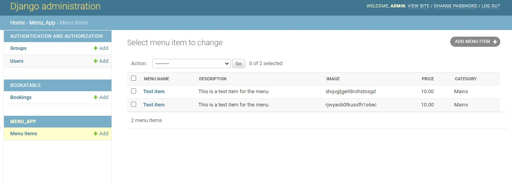
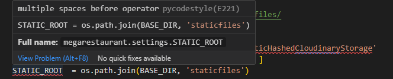
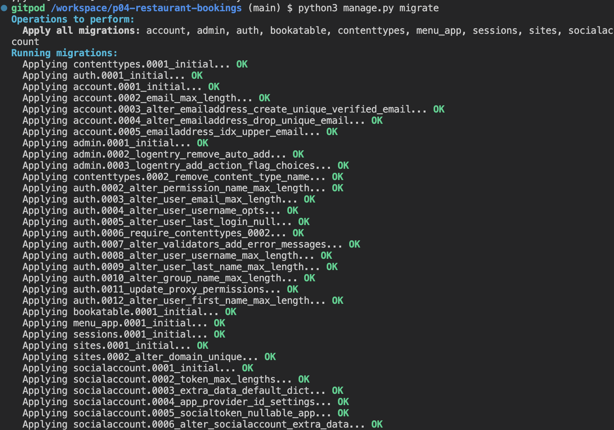
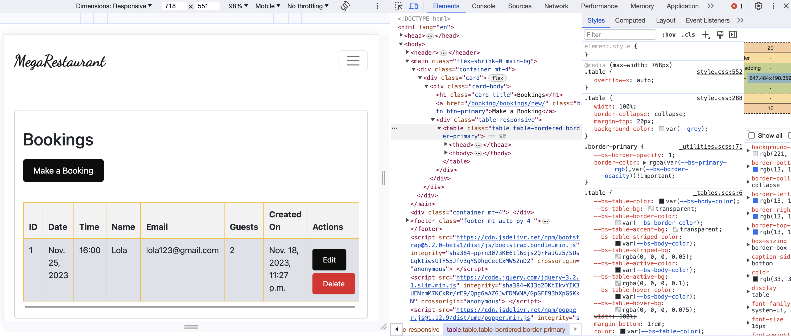
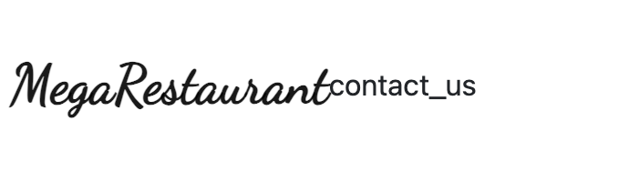

# MEGARESTAURANT

A web application that enables users to know more about the restaurant, manage bookings and view the menu, as well as a tool for restaurant owners and staff to organise their bookings.

Visit the live site: [Megarestaurant booking system](https://megarestaurant-20c7141b277b.herokuapp.com/)

## CONTENTS

- [AUTOMATED TESTING](#AUTOMATED-TESTING)
  - [Python Linter](#Python-Linter)
  - [Lighthouse](#Lighthouse)
- [MANUAL TESTING](#MANUAL-TESTING)
  - [Testing User Stories](#Testing-User-Stories)
  - [Full Testing](#Full-Testing)
- [BUG TRACKER](#BUG-TRACKER)
  - [Solved Bugs](#Solved-Bugs)
  - [Known Bugs](#known-Bugs)

---

Manual testing was carried out as soon as the project started using exploratory testing techniques and a list of bugs was identified and placed in a table to tackle.
At the same time as building the web, it was tested before moving to another steps and checking no major issues were found.
Afterwards, formal test cases were developed and executed.
Automated testing was carried out at a later stage using validators and all errors were fixed, it was checked that all user goals are met and after this, a test case table was created.

## AUTOMATED TESTING

### Python Linter

I used [Python Linter - Pep8CI](https://pep8ci.herokuapp.com/) to test for errors, most of the errors returned were related to formatting such as spacing or long lines of code, those were all fixed.

### Lighthouse

I used Lighthouse within the Chrome Developer Tools to test the performance, accessibility, best practices and SEO of the website.

#### Desktop Results

#### Mobile Results

---

---

## MANUAL TESTING

### Testing User Stories

#### 1A: As a user, I want to see a navigation menu so I can easily access all the content  
* **Acceptance Criteria:** A site user should always have access to the navigation menu so he can easily switch between pages at any time.
* **Summary:** 
    -When a user visits the website he can easily see the navigation menu at the top of the page; 
    -Even if switching the pages, the menu is always present at the top and indicates what page is currently active; 
    -For the *Home* page, a *Back to top* button is present at the end of the content,(considering screen sizes can vary depending on device used,) and redirects the user to the top of the page where he can access the navigation links; 
    -For logged-in clients, the menu contains an additional page, *Booking*, and *Logout* link replaces *Register* and *Login* pages; 
       *By testing all these features, it can be affirmed that the user story is accomplished.* 
* **Outcome:** Pass or Fail

#### 1B: As a user, I want to see relevant information about the restaurant
* **Acceptance Criteria:** A site user should be able to see relevant information about the restaurant.
* **Summary:**   
-When a user first visits the website, they are redirected to the *Home* page and an appealing cover is displayed, that ensures the user knows what the page at first sight;
-The cover also displays information about the welcome with name and slogan of the restaurant;
-"About us" is a section on the *Home* page that describes the restaurant and another image of the restaurant interior;
-More information about the restaurant specialities and contact details can be found on the *Menu* and *contact us* pages.

By testing all these features, it can be affirmed that the user story is accomplished.
* **Outcome:** Pass or Fail

#### 1C: As a user, I want the website to have a nice and intuitive design that will match the restaurant's theme
* **Acceptance Criteria:**  A site user should be able to access the content through an attractive design that would make him want to return to it anytime.
* **Summary:** 
    -When a user first visits the website he is redirected to *Home page* where the first impression is created when noticing the well-chosen fonts chosen for the navbar, title and slogan, as well as the cover image 
    -The colours of the website were tested to match the contrast requirements and all the colours chosen were generated from the colours' palette of the background cover 
    -Throughout the site there are elements created to help the user have a better experience when when navigating through the content 
    -On the Home suggest to the user to Register or Login to enjoy all the features of the website; 
    -The user gets button popup every time he performs an action such as Registering, Signing In/Signing Out, adding a booking  

    
    *By testing all these features, it can be affirmed that the user story is accomplished.* 
* **Outcome:** Pass or Fail 

### USER REGISTRATION/AUTENTHICATION
#### 2A: As a user, I want to be able to register on the website
* **Acceptance Criteria:** A site user should be able to create an account by filling in a form on the website.   
* **Summary:** 
    -There is a Register page that provides a form with email and password for the user to fill in; 
    -When the user submits the form a new entry is created in the Users table; 
    -A success message is displayed with the message "Logged in as..." that confirms to the user that he has been registered successfully.  

    *By testing all these features, it can be affirmed that the user story is accomplished.*  
* **Outcome:** Pass or Fail

#### 2B: As a user, I want to be able to authenticate using only email and password
* **Acceptance Criteria:** A site user should be able to authenticate at any time with email and password.
* **Summary:** 
    -There is a Login page that provides a form with email and password to be filled; 
    -The authentication form has a "Remember me" checkbox that will keep the user logged in; 
    -A success alert is displayed with the message "Logged in as..." that confirms to the user that he has been logged in successfully.  

    *By testing all these features, it can be affirmed that the user story is accomplished.*  
* **Outcome:** Pass or Fail

#### 2C: As a user, I want to be able to logout at any time
* **Acceptance Criteria:** A site user should be able to exit current account at any time.
* **Summary:**    
    -There is a Logout modal that can be triggered when clicking on the hyperlink in the navbar. The modal is implemented as part of defensive programming; 
    -The logout modal asks the user again if he wishes to exit the current account; 
    -A success button message is displayed with the message "You have signed out" that confirms to the user that he has been successfully logged out.  
    
    *By testing all these features, it can be affirmed that the user story is accomplished.*  
* **Outcome:** Pass or Fail

### BOOKING
#### 3A: As a logged in user, I want to be able to book a reservation for a specific date, time and number of table
* **Acceptance Criteria:** A logged user should be provided a booking system that generates the table  
* **Summary:**  
    -There is a booking page that can be accessed only by authenticated users, considering that all the booking entries must have the current user as the author; 
    -The booking sections appear successive only after the previous ones are validated; 
    -The first section contains inputs for Date, Start and End time, for the user to fill in; 
    -The validation of these values is very strict to prevent errors when generating the tables section. The following rules are being checked:
    * All the fields must be filled. 
    * The Date value should not be less than the current day; 
    * The user must choose from the available time slots provided.  

    - If the validation is complete, and the user submits the form, a successful feedback in a form of a button message is provided; But if there's no available table for the capacity required a message feedback is also given and the guest cannot proceed with the booking. 

    *By testing all these features, it can be affirmed that the user story is accomplished.*  
* **Outcome:** Pass or Fail

### MENU
#### 4A: As a user, I want to see the restaurant's menu with details about image,description and price, so that I can be completely aware of everything I want to order
* **Acceptance Criteria:** A user should be provided with a list of the menu content, as essential information for a restaurant client.
* **Summary:** 
    -There is a *Menu* page that can be accessed by any type of user; 
    -A list of meals is displayed and it is visible to any type of user; 
    -Every menu item is provided with an image of the meal, name, description and price; 
    -All images have the same dimensions, with transparent backgrounds, and prices are in bold, for better visual impact.  
    
    *By testing all these features, it can be affirmed that the user story is accomplished.*  
* **Outcome:** Pass or Fail

#### 5B: As a logged in user, I want to be able to edit or delete my bookings
* **Acceptance Criteria:** A logged in user should be provided a way to edit or delete a booking if he no longer wishes to keep it. 
* **Summary:** 
    -In the Bookings page, the user is presented with all the bookings information in a form of a table.
    -All the field information on this table can be updated via an 'edit' button.
    -Bookings can also be deleted via a 'delete' button. 

    *By testing all these features, it can be affirmed that the user story is accomplished.*  
* **Outcome:** Pass or Fail

### ADMIN MANAGE BOOKINGS
#### 6A: As a logged in admin member, I want to see the restaurant's upcoming bookings sorted by booking date and time
* **Acceptance Criteria:** A logged in admin member should be able to see all bookings from all the users via admin panel   
* **Summary:** 
    -There is a *Manage Bookings* page with all the bookings are visible only for logged-in admin members; 
    -The page displays all the bookings for the current day sorted by time, which is very helpful for a staff member that wants to take a look over today's reservations; 
    -The bookings are listed in a table and every column represents an important detail such as Date, Time, Number of table, and Customer name; 

    *By testing all these features, it can be affirmed that the user story is accomplished.*  
* **Outcome:** Pass or Fail

### CONTACT US
#### 7A: As a user, I want to see the restaurant's opening and closing hours
* **Acceptance Criteria:** A site user should be provided information about opening and closing hours for every day.
* **Summary:**   
    -There is a page called "Where to find us" visible to any type of user; 
    -The page displays a container with the timetable for every day of the week; 
    -The timetable has a simple and attractive design and the information is clear.  

     *By testing all these features, it can be affirmed that the user story is accomplished.*  
* **Outcome:** Pass or Fail

#### 7B: As a user, I want to see location information on the website
* **Acceptance Criteria:** A site user should be provided information about restaurant's location.
* **Summary:** 
    -On the "Where to find us" page there is a google map with a marker pointed to the restaurant's location; 
    -Also there is an informative text with the address of the restaurant;  

    *By testing all these features, it can be affirmed that the user story is accomplished.*  
* **Outcome:** Pass or Fail

#### 7C: As a user, I want to see contact information on the website
* **Acceptance Criteria:** A site user should be provided the restaurant's contact information.
* **Summary:**  
    -On the "Where to find us" page there is a section with contact information; 
    -The section displays the phone number and contact email for the restaurant.  

    *By testing all these features, it can be affirmed that the user story is accomplished.*  
* **Outcome:** Pass or Fail

### Full Testing

Full testing was performed on the following devices:

- Desktop:
  - Custom Gaming computer (Raven) with 2 screens set up 24 inches and Windows OS
- Laptop:
  - Mac book Pro 2023 14 inches screen and Mac OS
- Android Mobile Devices:
  - Samsung Galaxy S20
  - Samsung Galaxy A50

Each device tested the site using the following browsers:

- Google Chrome
- Safari
- Firefox

### Functionality Test Cases

Comprehensive testing has been conducted to ensure that all website functionalities are working as intended, providing users with a reliable and enjoyable browsing experience.

| Functionality | What's being tested | Result |
|------|-------------|--------|
| Registration | A new user can create an account successfully. | Pass |
|  | The website displays an appropriate error message with hint when validation fails. | Pass |
|  | The website displays an appropriate message if link is invalid or token expired | Pass |
|  | User is signed in automatically when click confirm button | Pass |
| Admin Panel | Admin can login to admin panel. | Pass |
|  | Admin can add, edit and delete bookings. | Pass |
|  | Admin can add edit and delete menu items. | Pass |
|  | Admin can add and delete guests. | Pass |
|  | Admin can delete users. | Pass |
|  | Admin panel can be accessed by user | Pass |
|Login | A registered user can log in successfully. | Pass |
|  | The website displays an appropriate error message when a user enters an incorrect email or password. | Pass |
|  | A logged-in user can sign out successfully. | Pass |
|  | The website displays an appropriate error message when a user enters invalid data (e.g., date before current day, not allowed charset). | Pass |
|  | A user cannot edit or delete another user's profile | Pass |
|Bookings CRUD | Verify that a logged-in user can create, edit delete his own bookings. | Pass |
|  | Confirmation message is displayed when changes are saved | Pass |
|  | User is asked for confirmation before deleting booking| Pass |
|  | Click on delete confirmation button deletes bookings | Pass  |
|  | A user can delete own bookings | Pass |
|  | Only authenticated users can book reservations | Pass |
|  | Confirmation message is displayed when booking is updated or deleted | Pass |
|Menu| A logged-in admin can add, edit or delete menu items. | Pass |

---

## BUG TRACKER

### Solved Bugs

| ID  | CLASS | FEATURE/SECTION                 | DESCRIPTION                                                                                                                                                                                                                            | STEPS TO REPRODUCE                                                                                                                                                                           | ACTUAL RESULT                                                               | EXPECTED RESULT                                 | ACTION                                                                                                                                                                                                                                                                                                                                                                                                                                                                                                    | STATUS                          |
| --- | ----- | ----------------------- | -------------------------------------------------------------------------------------------------------------------------------------------------------------------------------------------------------------------------------------- | -------------------------------------------------------------------------------------------------------------------------------------------------------------------------------------------- | --------------------------------------------------------------------------- | ----------------------------------------------- | --------------------------------------------------------------------------------------------------------------------------------------------------------------------------------------------------------------------------------------------------------------------------------------------------------------------------------------------------------------------------------------------------------------------------------------------------------------------------------------------------------- | ------------------------------- |
| 1   | A     | Django models |The models do not work correctly   | Create models>Run the server> Go to the website & log in in the admin panel> click on Bookatable > Observe the issue with the page not loading        | Error message when clicking on bookatable                                          |Please ensure that bookings are loading correctly| There was a message informing that the models have migrated correctly but when accessing the site this was not working     Tried to migrate again but when doing this the terminal informed that the migrations where up to date, as the message was saying that the id was not existing but it did, and considering another model was tried before, the server was set to run local,  and the error was logged to the console,    , Django migrations were removed and the database was reset. After this the migrations were run again successfully and this solved the issue.| FIXED|

| 2   | A     | Menu |The menu entry appears repeated   | Login as an admin > Go to the menu app> Enter an item and save it> Observe the issue with the item displaying twice      | The entry appears twice on screen                                          |Please ensure that the menu items are displaying correctly and only once per entry| It looks like the issue no longer occurs while progressing in the project and might have been a low reproduction rate bug| FIXED|

| 3  | A     | Static files |Heroku is not picking up css   | Go to the deployed app> observe the issue with the styles & images not loading      | Css not loading                                         |Please ensure that the page displays correctly| Fix typos in settings.py  & add different order for the allowed apps [Typo](docs/testing/3/order.png)| FIXED|

| 4  | A     | Error 505 | Error 505 shown when clicking on any database linked field  | Go to the deployed app> Click on login, sign in or register > Observe the issue with the 505 error      | Error 505 on heroku deployed app when trying to access the database                                         |Please ensure that the database works properly| The database was finding inconsistencies with previous data, as before deleting all remaining data from the local database, resetting elephant database and migrating the changes solved the issue | FIXED|

| 5  | A     | Irresponsive table | The table does not respond as expected in small screens  | Login as admin> Make a booking > Go to the booking list > Reduce the screen size using developer tools > Observe the issue with the table being clipped      | Table being clipped on small screens                                       |Please ensure that the table is fully visible in small screens| The style overflow-x:auto; is applied to style.css for small screens but it is not being shown on screen. This issue is shown only in the developer tools when resizing the vindow if picking a device on developer tools or selecting responsive dimensions it works well, also ok tested in smaller devices |FIXED|

| 6 | C     | Contact page front end - nav links |The active link is not being picked up   | Go to the site> Click on contact > Observe the issue with the active style not working      | When in the contact page the active link to indicate that the user is in the page was not working, {{url_name}} was added base.html template to check that it was pointing to the correct active link      and this was rectified as there was a typo saying contact instead of contact_us                                    |Please ensure that the page displays correctly|  | FIXED|

### Known Bugs

When trying to reset the password in the deployed app, there is an error message 505, it was not possible to implement authentication via email within Gitpod as mentioned in this [Bug report](https://github.com/gitpod-io/gitpod/issues/965), The ports used to send emails from Gitpod were blocked so it was impossible to set up email confirmation on account creation and also forgot password links.

---